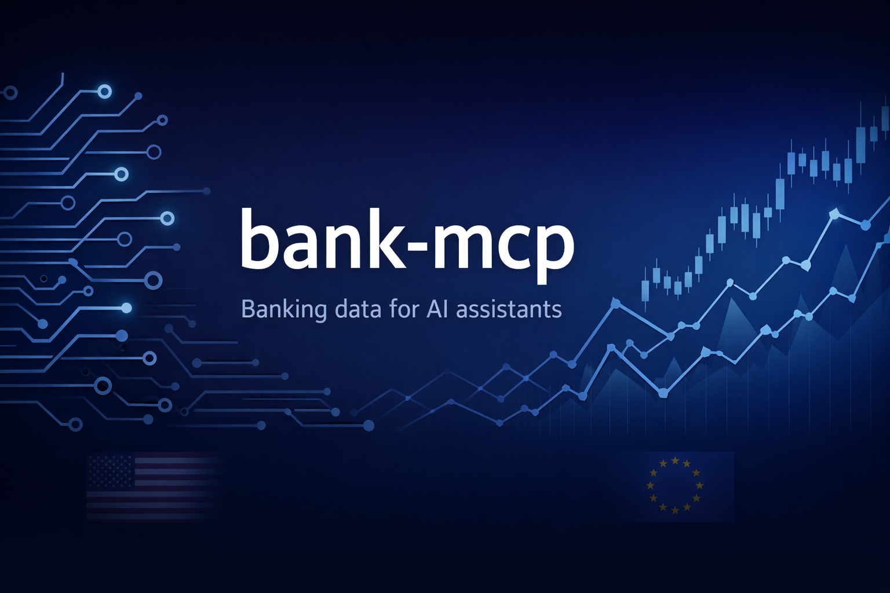
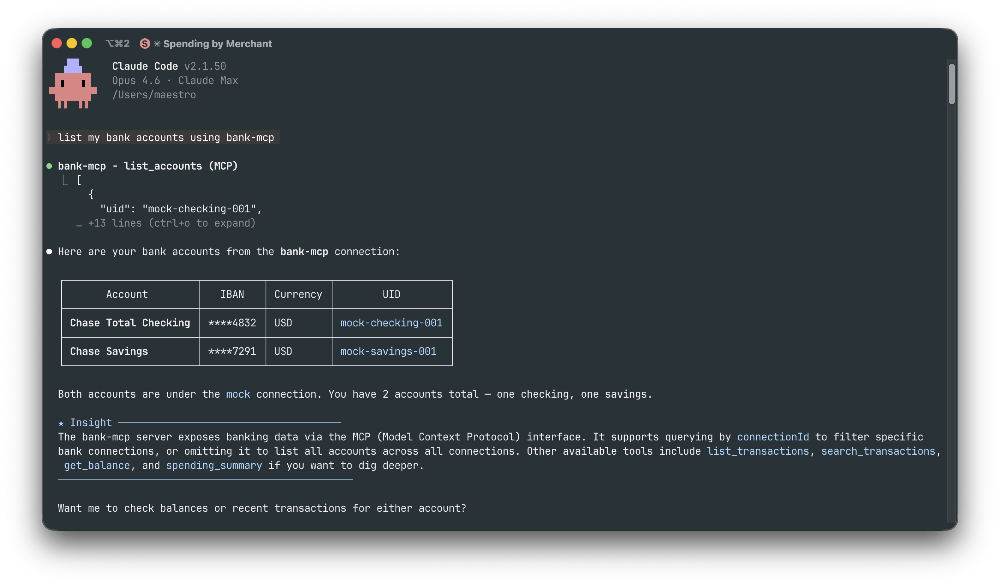
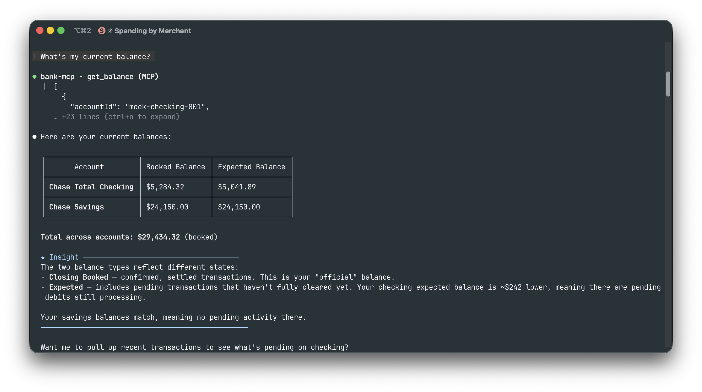
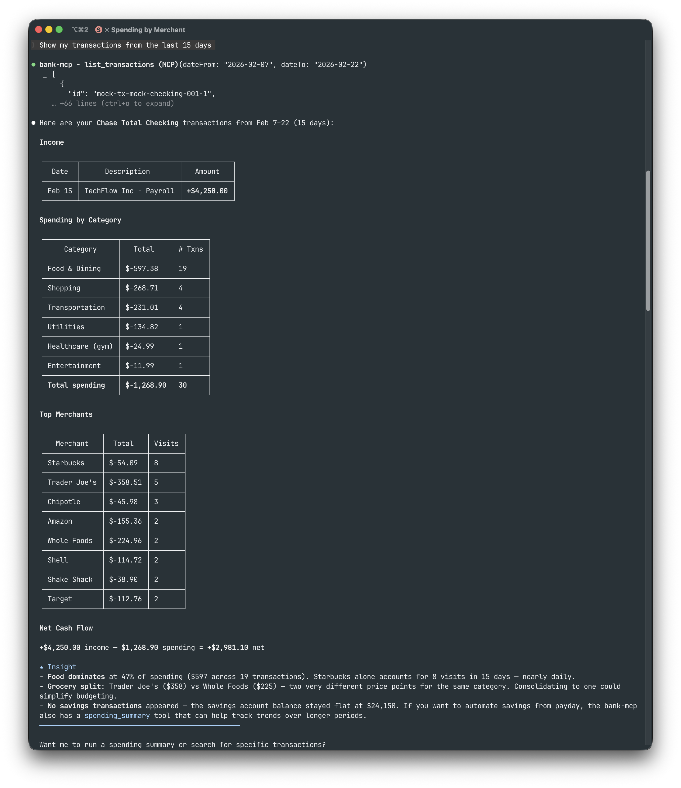
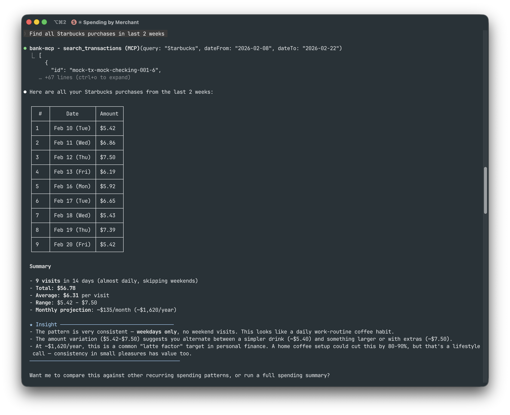
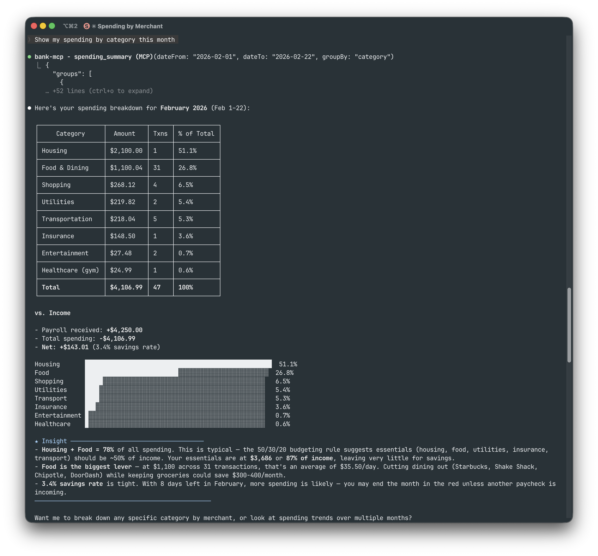
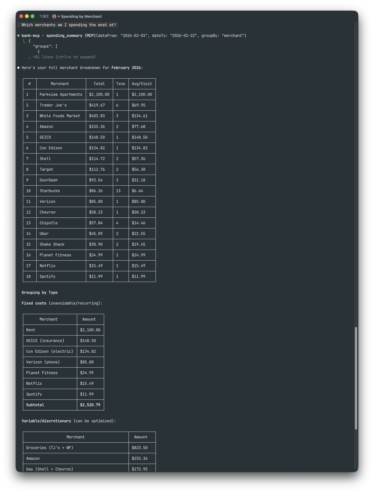
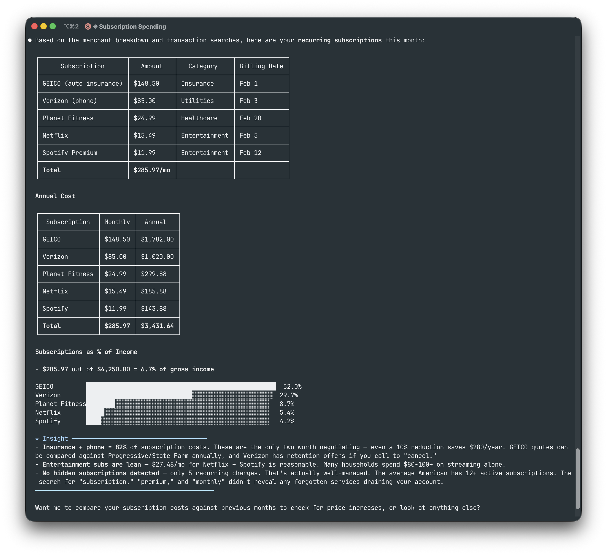
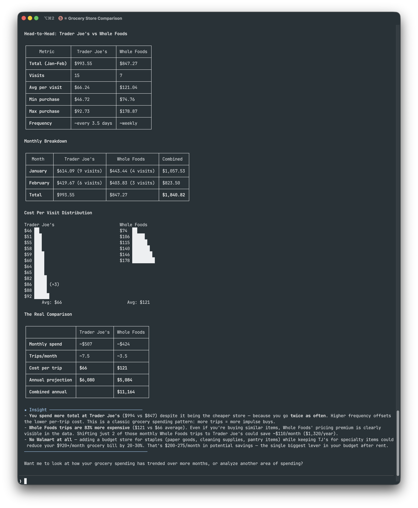
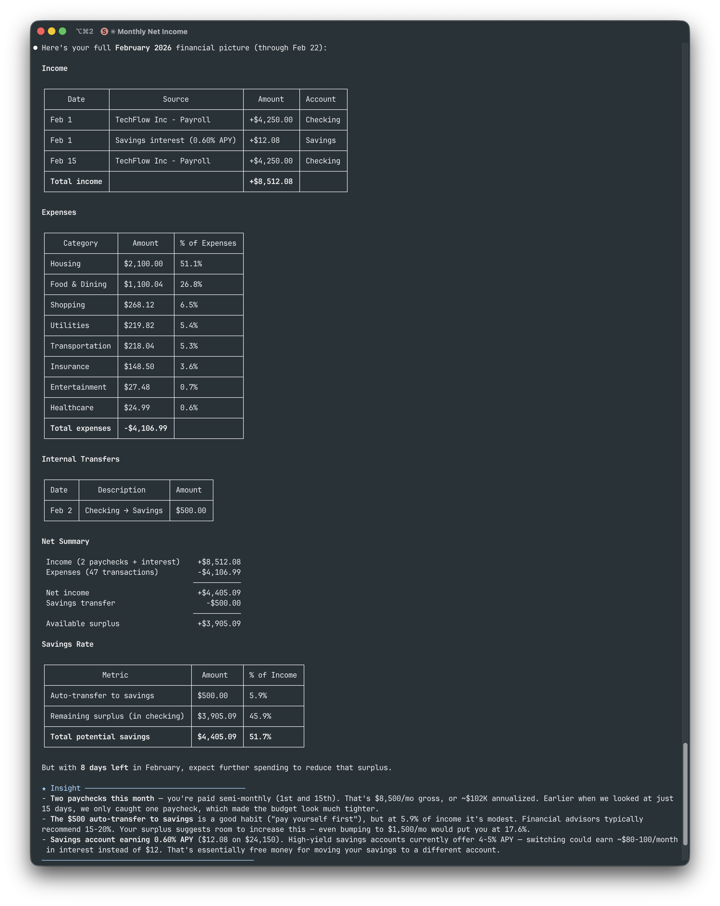

# 🏦 bank-mcp

<p align="center">
  
</p>

**Give your AI assistant secure, read-only access to your bank accounts.**

[](https://www.npmjs.com/package/@bank-mcp/server)
[](https://opensource.org/licenses/MIT)
[](https://github.com/elcukro/bank-mcp/actions/workflows/ci.yml)
[](https://nodejs.org/)
[](https://www.typescriptlang.org/)

---

Most people manage their finances by logging into bank portals, downloading CSVs, and building spreadsheets. bank-mcp eliminates that friction by letting your AI assistant query your bank accounts directly — balances, transactions, spending breakdowns — through natural conversation. It connects to real bank APIs via the [Model Context Protocol](https://modelcontextprotocol.io) so any MCP-compatible client (Claude Code, Claude Desktop, and others) can understand your finances.

- **5 providers, 15,000+ institutions** — US and European banks covered
- **Read-only by design** — no write access, no transfers, no modifications
- **Works with any MCP client** — Claude Code, Claude Desktop, Cursor, and more
- **Pluggable architecture** — add your own provider in under 100 lines

## Table of Contents

- [Supported Providers](#supported-providers)
- [Quick Start](#quick-start)
- [Client Setup](#client-setup)
- [Available Tools](#available-tools)
- [Screenshots](#screenshots)
- [Architecture](#architecture)
- [Provider Setup Guides](#provider-setup-guides)
- [Caching](#caching)
- [Multiple Connections](#multiple-connections)
- [Security](#security)
- [Adding a New Provider](#adding-a-new-provider)
- [Troubleshooting](#troubleshooting)
- [Development](#development)
- [Contributing](#contributing)
- [License](#license)

## Supported Providers

| Provider | Region | Institutions | Auth Method | Setup Difficulty |
|----------|--------|-------------|-------------|-----------------|
| **[Enable Banking](https://enablebanking.com)** | Europe | 2,000+ | RSA key + session | Medium |
| **[Teller](https://teller.io)** | US | 7,000+ | mTLS certificate | Medium |
| **[Plaid](https://plaid.com)** | US / CA / EU | 12,000+ | Client ID + secret | Easy |
| **[Tink](https://tink.com)** | Europe | 3,400+ | OAuth2 token | Easy |
| **Mock** | Demo | — | None | Instant |

### US Banks

Supported through Plaid and Teller — covering the top 20 US institutions and thousands more:

JPMorgan Chase · Bank of America · Wells Fargo · Citibank · Capital One · U.S. Bank · PNC · Truist · Goldman Sachs · TD Bank · Citizens · Fifth Third · M&T Bank · Huntington · KeyBank · Ally · Regions · BMO · American Express · USAA

### European Banks

Supported through Enable Banking and Tink — covering major banks across the EU and UK:

HSBC · BNP Paribas · Deutsche Bank · ING · Crédit Agricole · Santander · Société Générale · UniCredit · Intesa Sanpaolo · Barclays · Lloyds · BBVA · CaixaBank · Commerzbank · Rabobank · ABN AMRO · Swedbank · Handelsbanken · Nordea · PKO Bank Polski

## Quick Start

### 1. Configure a bank connection

```bash
npx @bank-mcp/server init       # Credential-based setup (all providers)
npx @bank-mcp/server connect    # Browser-based OAuth (Enable Banking, Tink)
```

`init` walks you through entering credentials manually. `connect` automates the browser-based OAuth flow — it opens your bank's login page, handles the callback, and saves the session automatically.

### 2. Add to your MCP client

Add bank-mcp to your AI tool's MCP configuration. Here's the most common setup:

**Claude Code** (`.mcp.json` in your project root or `~/.claude/.mcp.json` globally):

```json
{
  "mcpServers": {
    "bank": {
      "command": "npx",
      "args": ["@bank-mcp/server"]
    }
  }
}
```

> **Using a different tool?** See [Client Setup](#client-setup) for Claude Desktop, Cursor, VS Code, Windsurf, Codex CLI, Gemini CLI, and Zed.

### 3. Try it

Ask your AI assistant about your finances in natural language:

```
"What's my checking account balance?"
"Show my spending by category this month"
"Find all Amazon purchases over $50"
"Compare my spending this month vs last month"
```

### Demo Mode

Don't have bank credentials yet? Start with realistic fake data:

```bash
npx @bank-mcp/server --mock
```

This launches with a mock provider that generates deterministic sample accounts and transactions — perfect for testing your setup or building on top of bank-mcp before connecting real accounts.

## Client Setup

bank-mcp works with any MCP-compatible client. Pick your tool below.

### Claude Code

Add to `.mcp.json` in your project root (or `~/.claude/.mcp.json` for all projects):

```json
{
  "mcpServers": {
    "bank": {
      "command": "npx",
      "args": ["@bank-mcp/server"]
    }
  }
}
```

Or add via the CLI:

```bash
claude mcp add bank -- npx @bank-mcp/server
```

### Claude Desktop

Add to your `claude_desktop_config.json`:

```json
{
  "mcpServers": {
    "bank": {
      "command": "npx",
      "args": ["@bank-mcp/server"]
    }
  }
}
```

Config file location:
- **macOS:** `~/Library/Application Support/Claude/claude_desktop_config.json`
- **Windows:** `%APPDATA%\Claude\claude_desktop_config.json`

### Cursor

Add to `.cursor/mcp.json` in your project root (or `~/.cursor/mcp.json` globally):

```json
{
  "mcpServers": {
    "bank": {
      "command": "npx",
      "args": ["@bank-mcp/server"]
    }
  }
}
```

### VS Code (Copilot)

Add to `.vscode/mcp.json` in your workspace:

```json
{
  "servers": {
    "bank": {
      "type": "stdio",
      "command": "npx",
      "args": ["@bank-mcp/server"]
    }
  }
}
```

### Windsurf

Add to `~/.codeium/windsurf/mcp_config.json`:

```json
{
  "mcpServers": {
    "bank": {
      "command": "npx",
      "args": ["@bank-mcp/server"]
    }
  }
}
```

### OpenAI Codex CLI

Add to `~/.codex/config.toml` (or `.codex/config.toml` in your project):

```toml
[mcp_servers.bank]
command = "npx"
args = ["@bank-mcp/server"]
```

Or add via the CLI:

```bash
codex mcp add bank -- npx @bank-mcp/server
```

### Gemini CLI

Add to `~/.gemini/settings.json` (or `.gemini/settings.json` in your project):

```json
{
  "mcpServers": {
    "bank": {
      "command": "npx",
      "args": ["@bank-mcp/server"]
    }
  }
}
```

### Zed

Add to your Zed `settings.json`:

```json
{
  "context_servers": {
    "bank": {
      "command": {
        "path": "npx",
        "args": ["@bank-mcp/server"]
      }
    }
  }
}
```

> **Don't see your tool?** bank-mcp uses standard MCP stdio transport. Any client that supports MCP stdio servers can connect using `npx @bank-mcp/server` as the command.

## Available Tools

| Tool | Description | Key Parameters |
|------|-------------|----------------|
| `list_accounts` | List all bank accounts across connections | `connectionId?` |
| `list_transactions` | Fetch transactions with filtering | `accountId`, `from?`, `to?`, `minAmount?`, `maxAmount?` |
| `search_transactions` | Full-text search on descriptions and merchants | `query`, `accountId?`, `from?`, `to?` |
| `get_balance` | Current and available balances | `accountId`, `connectionId?` |
| `spending_summary` | Expenses grouped by merchant or category | `accountId`, `from?`, `to?`, `groupBy?` |

## Screenshots

All examples below use Claude Code with the mock provider (`npx @bank-mcp/server --mock`).

**Listing accounts** — *"List my bank accounts"*



**Checking balances** — *"What's my current balance?"*



**Transaction history** — *"Show my transactions from the last 15 days"*



**Searching transactions** — *"Find all Starbucks purchases in last 2 weeks"*



**Spending by category** — *"Show my spending by category this month"*



<details>
<summary><strong>More examples</strong> (merchant analysis, subscriptions, grocery comparison, financial overview)</summary>

<br>

**Top merchants** — *"Which merchants am I spending the most at?"*



**Subscription tracking** — *"Show my recurring subscriptions"*



**Grocery comparison** — *"Compare Trader Joe's vs Whole Foods spending"*



**Full financial picture** — *"Give me my full February financial picture"*



</details>

## Architecture

<p align="center">
  
</p>

### File Structure

```
~/.bank-mcp/
  config.json          # Connections & credentials (permissions: 600)
  keys/                # RSA keys and certificates

src/
  providers/
    base.ts            # Abstract BankProvider class
    registry.ts        # Provider registration
    enable-banking/    # PSD2 via Enable Banking API
    teller/            # US banks via mTLS
    plaid/             # US/CA/EU via Plaid API
    tink/              # EU Open Banking via Tink API
    mock/              # Deterministic fake data
  tools/               # MCP tool implementations
  utils/
    cache.ts           # In-memory TTL cache
    http.ts            # Fetch with timeout + retry
```

### Provider Interface

Every provider extends the same abstract class, making it straightforward to add new integrations:

```typescript
abstract class BankProvider {
  abstract listAccounts(config): Promise<BankAccount[]>;
  abstract listTransactions(config, accountId, filter?): Promise<Transaction[]>;
  abstract getBalance(config, accountId): Promise<Balance[]>;
  abstract getConfigSchema(): ConfigField[];
}
```

## Provider Setup Guides

### Enable Banking (PSD2)

**What you need:**
- [ ] An [Enable Banking](https://enablebanking.com) account with a registered app
- [ ] Your RSA private key (`.pem` file)
- [ ] An active session ID from the OAuth consent flow

```bash
npx @bank-mcp/server init
# Select: Enable Banking (PSD2)
# Enter: App ID, key path, session ID
```

> **Tip:** Sessions expire after 90 days (PSD2 regulation). You'll need to re-authenticate through the consent flow periodically. The server logs a clear message when a session expires.

### Teller (US Banks)

**What you need:**
- [ ] A [Teller](https://teller.io) developer account
- [ ] Your client certificate and private key (`.zip` download from the Teller dashboard)
- [ ] An access token from a Teller Connect enrollment

```bash
# Extract your certificate
mkdir -p ~/.bank-mcp/keys/teller
unzip ~/Downloads/teller.zip -d ~/.bank-mcp/keys/teller/
chmod 600 ~/.bank-mcp/keys/teller/*.pem

# Run setup
npx @bank-mcp/server init
# Select: Teller (US Banks)
# Enter: certificate path, key path, access token
```

> **Tip:** Teller uses mutual TLS (mTLS) — your app authenticates at the TLS layer via client certificate, then individual enrollments authenticate via access token. Free tier supports up to 100 live connections.

### Plaid (US/CA/EU)

**What you need:**
- [ ] A [Plaid](https://plaid.com) developer account (free signup)
- [ ] Your Client ID and Secret (from the Plaid dashboard)
- [ ] An access token from a Plaid Link enrollment

```bash
npx @bank-mcp/server init
# Select: Plaid (US/CA/EU)
# Enter: client ID, secret, access token, environment
```

> **Tip:** Start with the `sandbox` environment (fake data, instant setup). Plaid provides the richest transaction categorization — 104 sub-categories with confidence scores — which makes it ideal for LLM-driven spending analysis.

### Tink (EU Open Banking)

**What you need:**
- [ ] A [Tink](https://tink.com) developer account (free for testing)
- [ ] An OAuth2 access token (from the Tink Console or your OAuth2 flow)

```bash
npx @bank-mcp/server init
# Select: Tink (EU Open Banking)
# Enter: access token
```

> **Tip:** Tink covers 3,400+ banks across Europe. Transactions include PFM (Personal Finance Management) categories with merchant enrichment, and amounts use fixed-point decimals — no floating-point rounding surprises.

## Caching

All data is cached in-memory (no disk persistence — cache dies with the process):

| Data | TTL | Why |
|------|-----|-----|
| Account list | 1 hour | Accounts rarely change; minimizes API calls |
| Transactions | 15 minutes | Balances new transactions vs freshness |
| Balances | 5 minutes | Most time-sensitive; users expect current data |

Cache is per-connection and per-account. Restarting the server clears all caches.

## Multiple Connections

Configure as many bank connections as you need — even across different providers:

```json
{
  "connections": [
    { "id": "ing-main", "provider": "enable-banking", "..." : "..." },
    { "id": "chase-checking", "provider": "plaid", "..." : "..." },
    { "id": "revolut", "provider": "tink", "..." : "..." }
  ]
}
```

All tools accept an optional `connectionId` parameter to target a specific connection. When omitted, every connection is queried and results are merged — so "show all my balances" works across banks automatically.

## Security

### Design Principles

bank-mcp handles sensitive financial credentials. Its security posture is built on minimizing attack surface:

- **Read-only by design** — the `BankProvider` interface exposes only read methods (`listAccounts`, `listTransactions`, `getBalance`). There are no write methods — no transfers, no account modifications, no payment initiation. This is enforced at the type level, not by convention.
- **No network listener** — bank-mcp runs as a stdio process (stdin/stdout), not an HTTP server. There is no open port, no attack surface from the network.
- **Minimal dependencies** — only 3 runtime dependencies (`@modelcontextprotocol/sdk`, `jsonwebtoken`, `zod`). Fewer dependencies means fewer supply chain risks.
- **Open source** — every line is auditable. No obfuscated code, no compiled blobs, no telemetry.

### Credential Storage

- Config file at `~/.bank-mcp/config.json` is created with **`600` permissions** (owner read/write only)
- RSA keys and certificates are stored in `~/.bank-mcp/keys/` with the same restrictive permissions
- Credentials are **never logged** — the server sanitizes config objects before any debug output
- No credential caching beyond the process lifetime — when the server stops, credentials exist only on disk

### Data Flow

```
Your Bank's API ← HTTPS → bank-mcp (local process) ← stdio → MCP Client (local)
```

- Transaction data flows directly from your bank's API to your local MCP client
- **Nothing is stored remotely** — no cloud relay, no proxy server, no intermediate storage
- **No telemetry** — zero analytics, no crash reports, no usage tracking, no phone-home
- In-memory cache is per-process and dies when the server stops

### What Your MCP Client Sees

The MCP client (Claude, Cursor, etc.) receives structured tool results containing:
- Account names, types, and balances
- Transaction descriptions, amounts, dates, and categories
- Spending summaries

The LLM processes this in its context window. Be aware that cloud-hosted LLMs send your conversation (including tool results) to their servers. If this is a concern, use a local model or review your provider's data retention policy.

### Recommendations

- **Rotate tokens** — if your banking provider supports token rotation, enable it
- **Use sandbox first** — test your setup with mock data or Plaid sandbox before connecting live accounts
- **Review permissions** — ensure `~/.bank-mcp/` is not world-readable (`ls -la ~/.bank-mcp/`)
- **Scope access** — if your provider supports it, request the minimum scopes needed (read-only account and transaction access)

### Reporting Vulnerabilities

If you discover a security issue, please email the maintainer directly rather than opening a public issue. See [CONTRIBUTING.md](CONTRIBUTING.md) for contact details.

## Adding a New Provider

The pluggable architecture makes it straightforward to add support for additional banking APIs:

1. **Create your provider** at `src/providers/your-provider/index.ts`
2. **Extend `BankProvider`** — implement `listAccounts`, `listTransactions`, `getBalance`, and `getConfigSchema`
3. **Register it** in `src/providers/registry.ts`
4. **Add config fields** for the init wizard (the schema drives the interactive prompts automatically)

See [`src/providers/enable-banking/`](src/providers/enable-banking/) as a reference implementation. The mock provider at [`src/providers/mock/`](src/providers/mock/) is also useful for understanding the expected data shapes.

## Troubleshooting

**`npx` is running an old version**

npx caches packages. Force the latest:

```bash
npx @bank-mcp/server@latest
```

**"Permission denied" reading config**

The config file should be readable by your user:

```bash
ls -la ~/.bank-mcp/config.json
# Should show: -rw------- (600)
# Fix: chmod 600 ~/.bank-mcp/config.json
```

**"Session expired" (Enable Banking)**

PSD2 sessions expire after 90 days. Re-run the init wizard:

```bash
npx @bank-mcp/server init
# Select your existing Enable Banking connection to update the session
```

**Tools not showing up in your MCP client**

1. Verify the server starts: `npx @bank-mcp/server --mock` (should output MCP protocol on stdout)
2. Check your config file path matches your client's expected location
3. Restart your MCP client after adding the config
4. Check your client's MCP logs for connection errors

**"ETLS" or certificate errors (Teller)**

Teller requires mTLS. Verify your certificate files:

```bash
ls -la ~/.bank-mcp/keys/teller/
# Should contain: certificate.pem, private_key.pem
# Both should be chmod 600
```

## Development

```bash
git clone https://github.com/elcukro/bank-mcp.git
cd bank-mcp
npm install
npm test          # Run tests (vitest)
npm run build     # Compile TypeScript
npm run dev       # Watch mode (recompile on change)
npm run lint      # ESLint
```

## Contributing

Contributions are welcome! Please see [CONTRIBUTING.md](CONTRIBUTING.md) for guidelines.

If you're adding a new provider, open an issue first to discuss the approach — we want to make sure the integration fits the project's architecture.

## License

[MIT](LICENSE) — use it however you want.

---

<p align="center">
  Built for the <a href="https://modelcontextprotocol.io">Model Context Protocol</a> ecosystem
</p>
